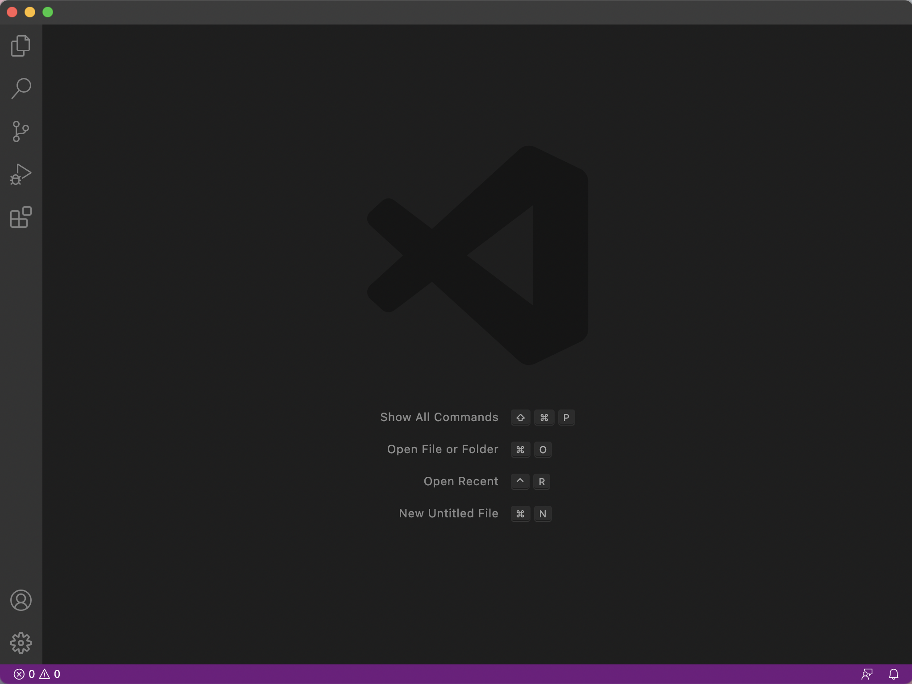
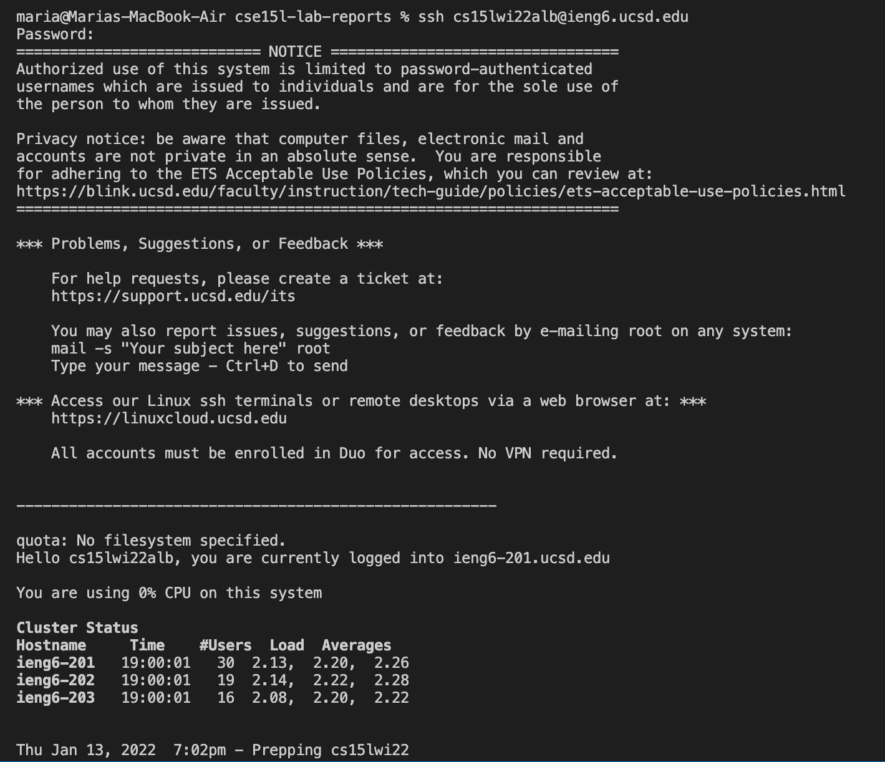
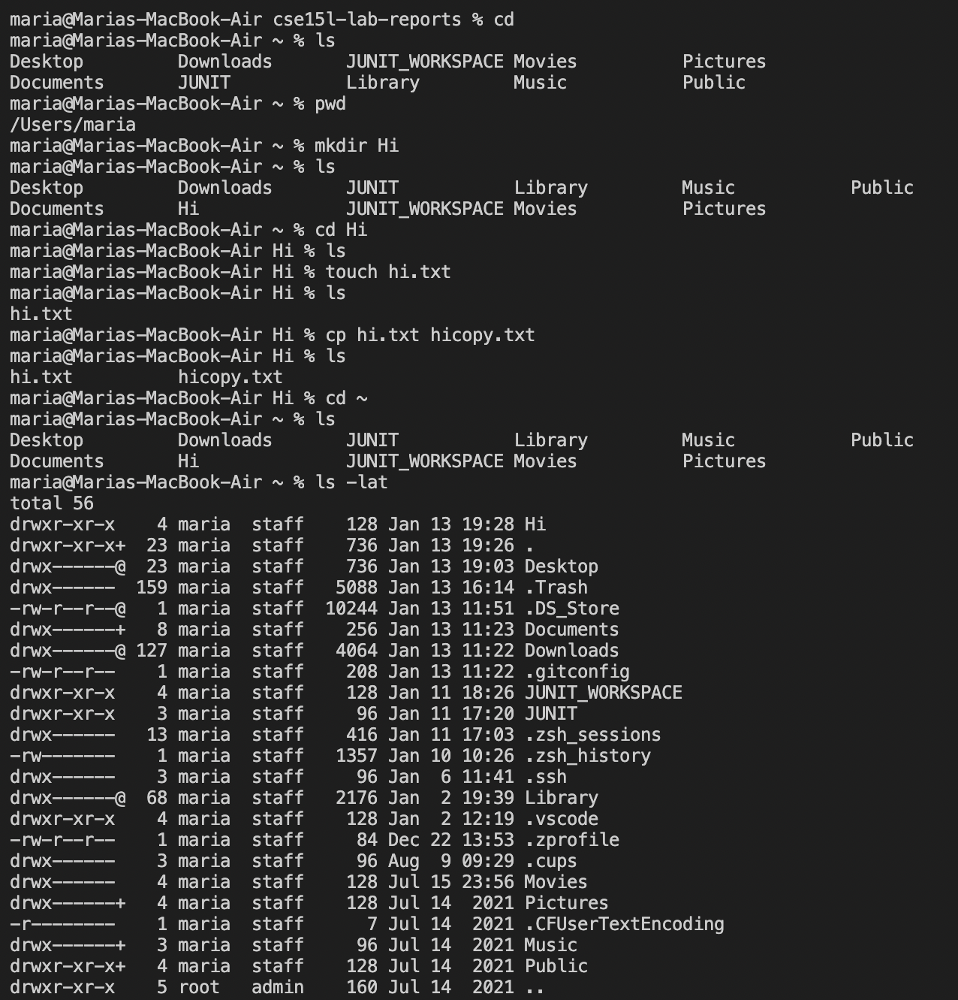
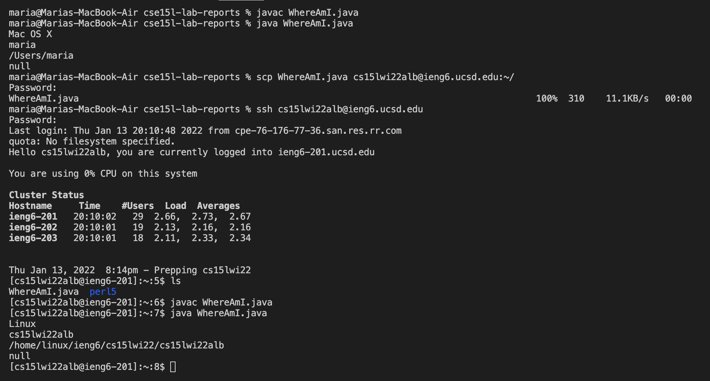
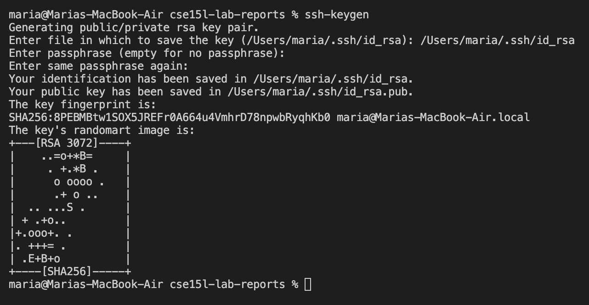
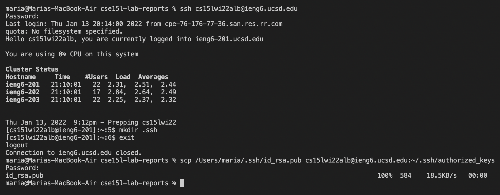
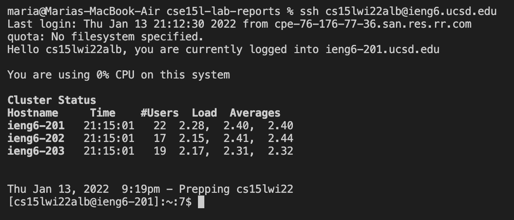
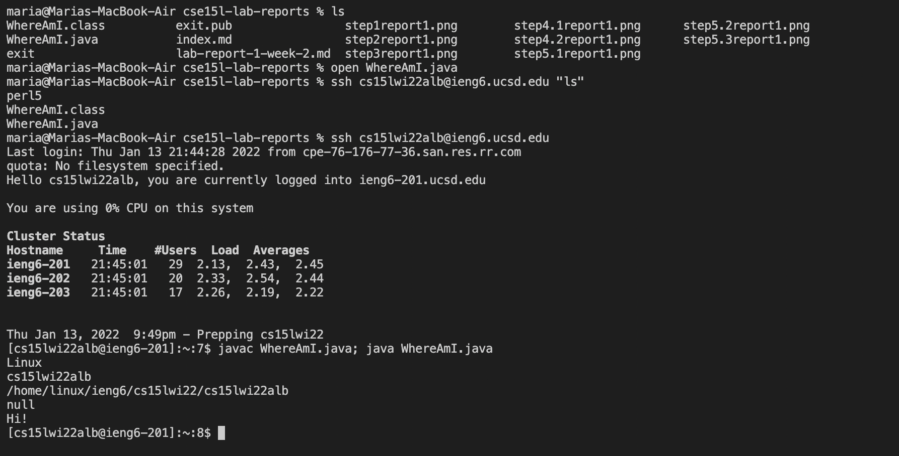

# 1. Installing VS Code
Download and install Visual Studio Code from the website [here](https://code.visualstudio.com/).
Choose the version for your operating system (for example, OSX (for Mac) and Windows (for PC)).

Once you have installed VS Code, you should be able to open a window that looks something like this:



# 2. Remotely Connecting
The first step, if you are on Windows, is to install the program OpenSSH, which connects your computer to other computers that have the kind of account that we will be setting up in the next steps.

1. Install [OpenSSH](https://docs.microsoft.com/en-us/windows-server/administration/openssh/openssh_install_firstuse).

2. Look up your course-specific account for CSE 15L [here](https://sdacs.ucsd.edu/~icc/index.php).

3. In Visual Studio Code, we're going to connect to the remote computer using VSCode's remote option. For reference, we are following the steps under ["Connect to a remote host"](https://code.visualstudio.com/docs/remote/ssh#_connect-to-a-remote-host). 

4. Open a terminal in VSCode (Ctrl or Command + `, or use the Terminal -> New Terminal menu option). Enter the command "ssh cs15lwi22XXX@ieng6.ucsd.edu" with your course-specific account. Then, there will be one or two more steps and the whole interaction will look something like this:



Now your terminal is connected to a computer in the CSE basement, which is where your commands will run.

# 3. Trying Some Commands

Try running the commands cd, ls, pwd, mkdir, and cp in a few different words on both *your* computer and the remote computer after ssh-ing.

Here are some other useful commands to try:
* `cd ~`
* `cd`
* `ls -lat`
* `ls -a`
* ```ls <directory> where <directory> is /home/linux/ieng6/cs15lwi22/cs15l22XXX (replace XXX with the letters in your account)```
* `cp /home/linux/ieng6/cs15lwi22/public/hello.txt ~/`
* `cat /home/linux/ieng6/cs15lwi22/public/hello.txt`

To log out of the remote server in your terminal:
* Ctrl-D
* Run the command exit

**Note**: Open more terminals in VSCode with the + button at the top of the terminal window.



# 4. Moving Files with scp

Always run the command scp from the *client* (meaning from your computer, not logged into ieng6). 

1. Create a file on your computer called WhereAmI.java and put the content below into it. Run it using javac and java. 

```
class WhereAmI {
    public static void main(String[] args) {
        System.out.println(System.getProperty("os.name"));
        System.out.println(System.getProperty("user.name"));
        System.out.println(System.getProperty("user.home"));
        System.out.println(System.getProperty("user.dif"));
    }
}
```

2. Then, in the terminal from the directory where you made WhereAmI.java, run the command `scp WhereAmI.java cs15lwi22XXX@ieng6.ucsd.edu:~/!`
 using your username. Enter your password, log into ieng6 with ssh again, and use ls. WhereAmI.java should be in your home directory. Now you can use javac and java to run WhereAmI.java on the ieng6 computer.

 

# 5. Setting an SSH Key

Run the following (with your name) on the client (your computer) to set up an ssh key with the program ssh-keygen:



**Note:** If you are on Windows, follow the extra ssh-add steps [here](https://docs.microsoft.com/en-us/windows-server/administration/openssh/openssh_keymanagement#user-key-generation).

Next, copy the *public* key (the public key is in a file id_rse.pub and the private key is in a file id_rsa) to the .ssh directory of your user account on the server:



After doing this, you should be able to ssh or scp from this client to the server without entering your password.



# 6. Optimizing Remote Running

* You can write a command in quotation marks at the end of an ssh command to directly run it on the remote server, then exit. 
* In most terminals, you can run multiple commands on the same line by using semicolons.
* You can use the up-arrow on your keyboard to recall recent commands that were run.



I don't remember exactly how I did this, but if I were to have used only up-arrow strokes to enter most of the commands, I would probably have done about 27 keystrokes including editing WhereAmI.java. I could have maybe lessened this number even more by copy pasting my edit into WhereAmI.java and having ```javac WhereAmI.java; java WhereAmI.java``` as one line that I could access all together by up-arrow-ing. Also, if I knew I was already in the right directory, I could have cut out the keystrokes for entering ```ls```. If I had done all this, my keystroke count might have closer to about 8 (including Ctrl+S to save the edits) if you didn't count the mouse clicks of copy pasting the edits to WhereAmI.java. If you include those, the count might be more like 10. 


