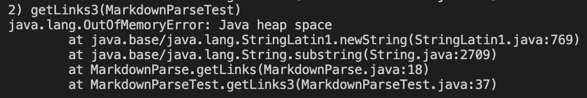
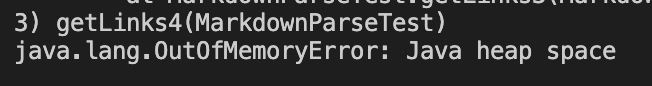

# Bug 1

# Bug 2

The failure-inducing input was having an extra open paren in the link address. This caused the symptom of an infinite loop and OutOfMemoryError.

# Bug 3

The failure-inducing input was having the entire link format inside parentheses. This caused the symptom of an infinite loop and OutOfMemoryError.

# Note
Sorry, I wasn't able to figure out how to fix these bugs. We didn't have a lot of time at the end of this week's lab to actually debug, so I think we are just doing it on our own, but I'm not sure how and I ran out of time so I thought I would at least submit something. 