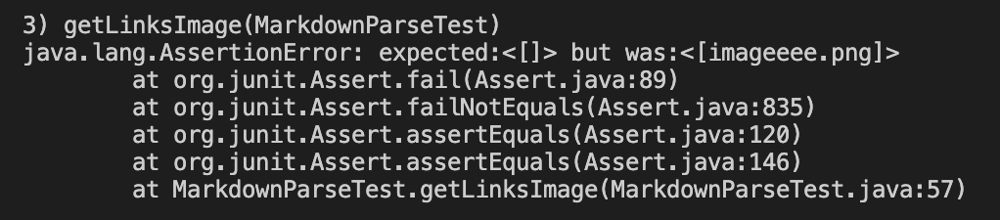

# Bug 1

__Code changes:__


[Link to test file for bug 1](https://github.com/mariawaseem/markdown-parse/blob/main/test-file-2.md)

Test in MarkdownParseTest:

```
@Test
    public void getLinks2() throws IOException {
        Path fileName = Path.of("test-file-2.md");
	    String contents = Files.readString(fileName);
        ArrayList<String> links = MarkdownParse.getLinks(contents);
        System.out.println(links);
        assertEquals(List.of("link.(com"), links);
    }
```

The failure-inducing input was having an extra open paren in the link address. This, again, caused the symptom of an infinite loop and OutOfMemoryError.

__Output:__


This input created an infinite loop because the index kept setting back to -1 and looping through the text in the test file over and over again. To fix this, I added an if statement that checks for the index equaling -1 and stops if any of the indexes equal -1.

# Bug 2

__Code Changes:__


[Link to test file for bug 2](https://github.com/mariawaseem/markdown-parse/blob/main/image-test.md)

Test in MarkdownParseTest:

```
@Test
    public void getLinksImage() throws IOException {
        Path fileName = Path.of("image-test.md");
	    String contents = Files.readString(fileName);
        ArrayList<String> links = MarkdownParse.getLinks(contents);
        System.out.println(links);
        assertEquals(new ArrayList<>(List.of()), links);
    }
```

The input was an image which should not be considered a link. The symptom was the .png being returned and printed as if it was a link.

__Output:__



Some different failures also came up while trying to fix the original one:


The input was an image, so it should have returned nothing, but instead it returned the .png, which is not a link. The code change to fix this was to check for an exclamation mark immediately before the opening bracket, as well as some other changes to fix the failures that came up while trying to fix the original bug.

# Bug 3

__Code Changes:__


[Link to test file for bug 3](https://github.com/mariawaseem/markdown-parse/blob/main/test-space-in-url.md)

Test in MarkdownParseTest:

```
@Test
    public void getLinksSpaceinURL() throws IOException {
        Path fileName = Path.of("test-space-in-url.md");
	    String contents = Files.readString(fileName);
        ArrayList<String> links = MarkdownParse.getLinks(contents);
        System.out.println(links);
        assertEquals(new ArrayList<>(List.of()), links);
    }
```

The failure-inducing input was having a space in the url of the link. This should not be included in the output since it is not a valid link, however it was included and produced a failure.

__Output:__


The input was a link with a space in the url, which does not create a valid link, so it should not be returned by MarkdownParse. However, it was, so to fix this bug, we check that the index of the space in the link is not in the middle of it by checking if the index of the space is equal to -1. If it is, the link can be added.