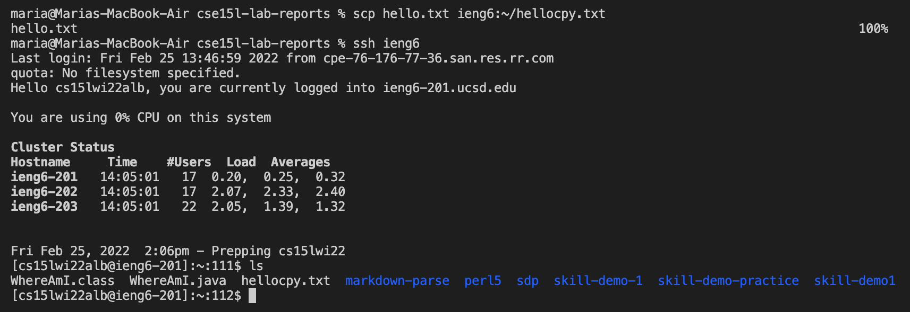

# Streamlining ssh Configuration

My .ssh/config file and commands I used:ss

The ssh command logging me into my account using the alias that I chose:

The scp command copying the file hello.md to my account using just the alias that I chose:

