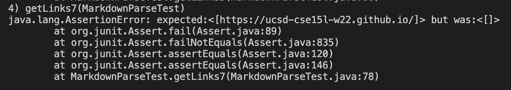

# Links: 

Link for my markdown-parse repository: [MyRepo](https://github.com/mariawaseem/markdown-parse.git)

Link to the markdown-parse repository we reviewed: [ReviewedRepo](https://github.com/IncogOwl/markdown-parse.git)

# Tests:
## Snippet 1 Test:

__Commonmark:__


``` `google.com ```, `google.com`, and `ucsd.edu` become valid links

__My implementation:__

Code in MarkdownParseTest.java:


Corresponding output:


This test failed and you can see that `url.com` was part of the actual output, but it was not part of the expected output because it should not have been included.

__The implementation we reviewed:__

Code in MarkdownParseTest.java:


(Same as code in my implementation.)

Corresponding output:


This test failed and you can see that `url.com` was part of the actual output, but it was not part of the expected output because it should not have been included. 

## Snippet 2 Test:

__Commonmark:__


`a.com`, `a.com((`, and `example.com` become valid links

__My implementation:__

Code in MarkdownParseTest.java:


Corresponding output:


This test didn't fail, so it doesn't show up in the list of failed tests. There were 2 failures and the test for snippet 2 was not one of them.

__The implementation we reviewed:__

Code in MarkdownParseTest.java:


(Same as code in my implementation.)

Corresponding output:


This test didn't fail, so it doesn't show up in the list of failed tests. There were 4 failures and the test for snippet 2 was not one of them.

## Snippet 3 Test:

__Commonmark:__


only `https://ucsd-cse15l-wi22.github.io/` becomes a valid link

__My implementation:__

Code in MarkdownParseTest.java:


Corresponding output:


This test failed and you can see that the expected output was `https://ucsd-cse15l-w22.github.io/`, but the actual output was 
```
    https://www.twitter.com
, 
    https://ucsd-cse15l-w22.github.io/
, github.com

And there's still some more text after that.

[this link doesn't have a closing parenthesis for a while](https://cse.ucsd.edu/
```


__The implementation we reviewed:__

Code in MarkdownParseTest.java:


(Same as code in my implementation.)

Corresponding output:



This test failed and you can see that the expected output was `https://ucsd-cse15l-w22.github.io/`, but the actual output was nothing.

# Three Questions:

__1. Snippet 1:__

It seems that MarkdownParse works for cases that use inline code with backticks. The problem was that it also included `url.com`, which was not part of the expected output (as seen on the CommonMark Demo Site). "`[a link`" is inline code because of the backticks (\`[a link\`]) and breaks the link. So, Markdown Parse should not include `url.com` as a valid link. To fix this, you could use an if statement that checks for an "open" and "close" backticks in a link and their placement in that link. Backticks inside brackets/parentheses produce links that work and "close" backticks after the closing parenthesis also produce a link that works.

__2. Snippet 2:__

Both my implementation and the review code's implementation didn't fail for the snippet 2 test.

__3. Snippet 3:__

My implementation outputed a lot more than what was expected, which was just one link. According to the CommonMark Demo Site, `https://www.twitter.com` and `https://cse.ucsd.edu/` do not create valid links. My implementation included these, but also included 
```
github.com

And there's still some more text after that.

[this link doesn't have a closing parenthesis for a while](https://cse.ucsd.edu/
```
because all of this text is between open and close parentheses. To fix this problem, you need to use if statements to check for line breaks and if a new link starts before another ends.
