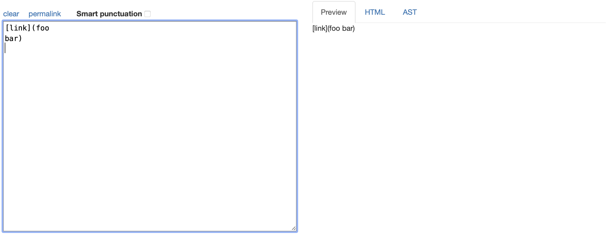
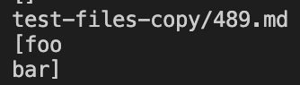

# How I found the tests with different results

To find the two tests with different outputs from my implementation and the course's implementation, I copied the test-files folder into my markdown-parse and used bash script.sh to see the outputs of the two implementations. To figure out exactly which test files were giving different outputs, I added echo $file to the script.sh file in both markdown parses. This printed out the test file name before the output from the implementation. This made is easy to manually compare the outputs and find test files that had different outputs for the two implementations. I chose test file 489 and 495 to include in this lab report.

# Test 1 (test-files/489.md)

__Test case:__

__Excpected output:__

The link doesn't work, so the expected output from the implementations should be nothing or an empty string.

__My implementation's output:__

__Other implementation's output:__

---

In this case, the course's implementation gave the correct output because the line break in `foo bar` makes it an invalid link and so it should not be included in the output of the implementations. To fix my implementation which includes `foo bar` with a line break (meaning it seems to accept line breaks in links in general), you would have to check for line breaks in the links and not include them in the output string if they do contain line breaks. You could do this with an if statement.

You could add the check to this if statement with an "and" (`&&`) operator:

---

# Test 2 (test-files/495.md)

__Test Case:__

__Excpected Output:__

It's difficult to see the expected output from this since it doesn't show what the link looks like in the background. By trying to open the link in another tab, I was able to find out that the link looked like this:

So, the expected output from the implementations should be been `foo(and(bar))`.

__My implementation's output:__

__Other implementation's output:__

---

In this case, the course's implementation gave the right output again because the expected output was `foo(and(bar))` since the this test case creates a valid link and the "background link" is `foo(and(bar))`, not `foo(and(bar` as my implementation outputs. To fix my implementation, you would have to check for more closed parentheses after the first one, so it doesn't stop at the first parenthesis. You could do this with a while loop that keeps looping until the space after the closed parenthesis isn't another closed parenthesis. My implementation's output was incorrect because it included the part of the link that was before the first parenthesis, when it should have continued and included everything until the last closed parenthesis. 

You would put while loop before the following statement so that the closed parenthesis in updated to the last one before adding the link to the string.

---